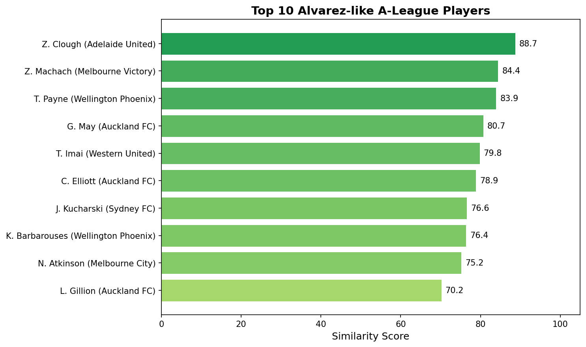
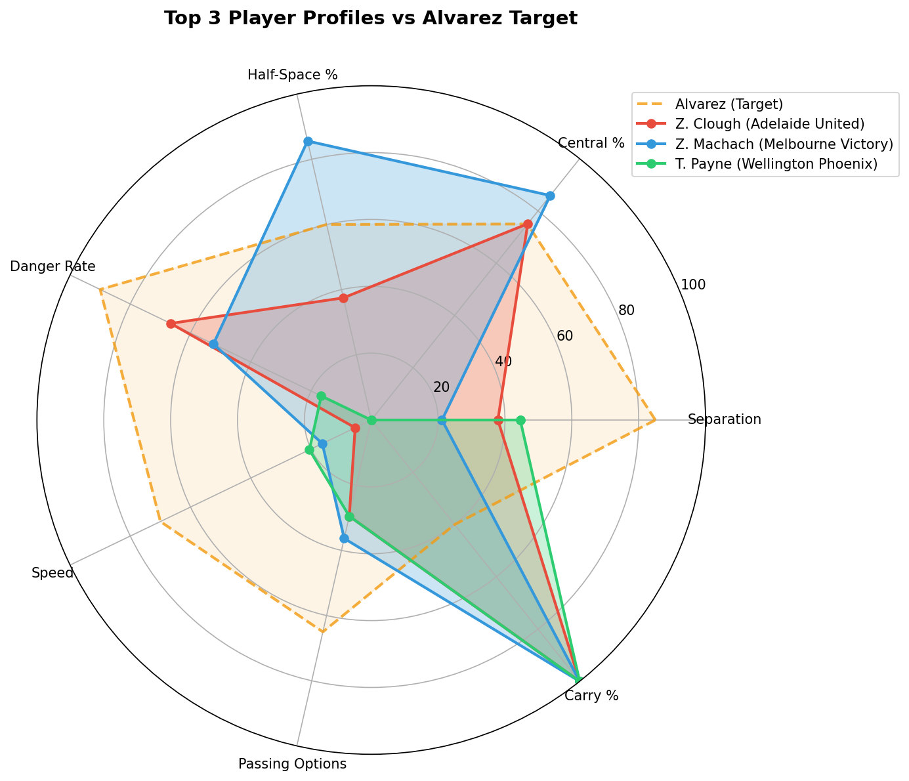

# Finding Alvarez (and Others) in the A-League

SkillCorner X PySport Analytics Cup 2026 - Research Track

A player similarity study using broadcast tracking data to identify A-League players with characteristics matching world-class archetypes.

**[View Documentation](https://karimelgammal.github.io/analytics_cup_research/)** | **[Live Demo](https://huggingface.co/spaces/KarimElgammal/analytics-cup-research)**

[](https://mybinder.org/v2/gh/KarimElgammal/analytics_cup_research/HEAD?labpath=submission.ipynb)

---

## Abstract

### Introduction

This research assesses whether SkillCorner tracking data can identify A-League players matching world-class archetypes. Using broadcast tracking data from 10 A-League matches, I compare players against 12 archetypes derived from StatsBomb World Cup 2022 data across forwards, defenders, and goalkeepers.

### Methods

The workflow supports three position types: forwards (Alvarez, Giroud, Kane, Lewandowski, Rashford, En-Nesyri), defenders (Gvardiol, Romero, Hakimi), and goalkeepers (Lloris, Livakovic, Bounou). Each position uses different event data—forwards use final third entries (245 events), defenders use on-ball engagements (8,911 events), and goalkeepers use distribution events (522 events). Similarity is computed using weighted cosine similarity on z-score normalised features, with weights derived from correlation analysis on A-League data.

### Results

For the Alvarez archetype, top candidates are T. Imai (Western United) at 96.5% similarity with exceptional separation (5.64m), N. Atkinson (Melbourne City) at 93.5%, and K. Bos (Melbourne Victory) at 91.6%. These players exhibit Alvarez's key trait: creating danger through intelligent movement rather than dribbling.





### Conclusion

SkillCorner tracking data can effectively identify players matching specific archetypes across positions. The approach combines domain knowledge from StatsBomb event data with correlation-based weights, demonstrating practical applications for data-driven scouting in the A-League.

---

## Installation

### Option 1: Quick Start (Recommended)

The app launcher handles everything automatically:

```bash
git clone https://github.com/KarimElgammal/analytics_cup_research.git
cd analytics_cup_research
./run.sh
```

This will:
1. Install `uv` if not present
2. Create a Python 3.12 virtual environment
3. Install all dependencies
4. Launch the Streamlit app

### Option 2: Manual Setup

```bash
git clone https://github.com/KarimElgammal/analytics_cup_research.git
cd analytics_cup_research

# Using uv (recommended)
uv venv --python 3.12
uv pip install -r requirements.txt

# Or using pip
python -m venv .venv
source .venv/bin/activate  # On Windows: .venv\Scripts\activate
pip install -r requirements.txt
```

---

## Running

### Interactive App (Archetype Comparison)

```bash
./run.sh
# Or manually:
uv run streamlit run app.py
```

### Research Notebook

```bash
uv run jupyter notebook submission.ipynb
# Or with pip:
jupyter notebook submission.ipynb
```

---

## Archetype Comparison Tool

The interactive Streamlit app (`app.py`) allows comparison across all positions:

| Position | Data Source | Players | Archetypes |
|----------|-------------|---------|------------|
| Forwards | Final third entries (245) | 31 | Alvarez, Giroud, Kane, Lewandowski, Rashford, En-Nesyri |
| Defenders | Defensive engagements (8,911) | 185 | Gvardiol, Romero, Hakimi |
| Goalkeepers | Distribution events (522) | 13 | Lloris, Livakovic, Bounou |

---

## Project Structure

```
analytics_cup_research/
├── submission.ipynb      # Research notebook
├── app.py                # Streamlit app
├── run.sh                # App launcher
├── requirements.txt
├── docs/
├── scripts/
└── src/
    ├── core/             # Archetype, SimilarityEngine
    ├── data/             # Data loading
    ├── analysis/         # Player profiles
    ├── statsbomb/        # Archetype factory
    ├── utils/            # AI insights
    └── visualization/
```

For detailed technical documentation, see [docs/methodology.md](docs/methodology.md) or visit the [full documentation](https://karimelgammal.github.io/analytics_cup_research/).

---

## AI Insights (if you need your own inferencing)

The app includes AI-powered scouting insights. To enable at your own cost:

### Local Development

```bash
# Option 1: GitHub Models
echo "your_github_token" > github_token.txt

# Option 2: HuggingFace
echo "your_hf_token" > hf_token.txt
```

### Using Local Models (Ollama)

Edit `src/utils/ai_insights.py` to add a local backend:

```python
# Add to generate_similarity_insight():
import requests

def call_local_model(prompt: str) -> str:
    response = requests.post(
        "http://localhost:11434/api/generate",
        json={"model": "llama3.2", "prompt": prompt, "stream": False}
    )
    return response.json()["response"]
```

**Available Cloud Models:**
| Backend | Models |
|---------|--------|
| GitHub | Grok 3 Mini (expensive, reasoning model), Phi-4, GPT-4o Mini |
| HuggingFace | Llama 3.1 8B, Llama 3.2 3B, Qwen 2.5 7B, SmolLM3 3B, Gemma 2 2B |

**Note:** Rate limits apply on the hosted demo. Running locally has no limits.

---

## URL to Web App

**Live Demo:** https://huggingface.co/spaces/KarimElgammal/analytics-cup-research

---
# Everything in a Nutshell
## Links
  - Online streamlit demo: https://huggingface.co/spaces/KarimElgammal/analytics-cup-research
  - Documentation: https://karimelgammal.github.io/analytics_cup_research/
  - GitHub: https://github.com/KarimElgammal/analytics_cup_research
  - Binder: https://mybinder.org/v2/gh/KarimElgammal/analytics_cup_research/HEAD?labpath=submission.ipynb

## Highlights
  - Cross-dataset integration: StatsBomb World Cup 2022 → SkillCorner A-League archetypes
  - Weighted cosine similarity with correlation-based feature weights
  - 12 archetypes across 3 positions: 6 forwards, 3 defenders, 3 goalkeepers
  - AI-powered scouting insights via GitHub Models / HuggingFace APIs

## Research Focus:
Demonstrates that SkillCorner broadcast tracking data can identify A-League players matching world-class archetypes derived from StatsBomb event data, enabling data-driven scouting across positions.
---

SkillCorner X PySport Analytics Cup 2026 - Research Track Submission
